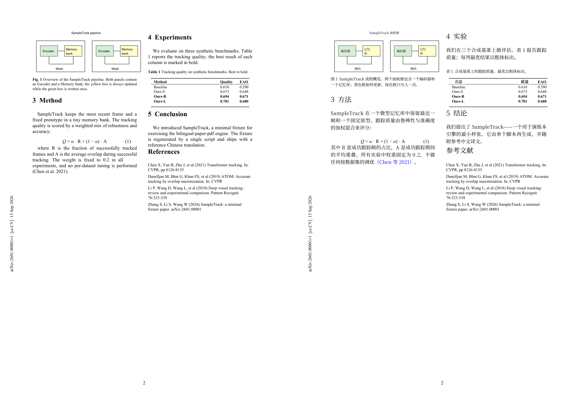

# bilingual-paper-pdf — 论文级中英双语对照 PDF 生产工具

把一篇英文论文 PDF 变成**左页英文原样、右页中文镜像排版**的双语对照 PDF。
右页不是重排的译文稿，而是原页的完整克隆：图、表、公式、脚注横线、页码、arXiv
侧边印章**分毫不差**地保留，只抹掉正文文字，把中文"住"进原文腾出来的空间里——
每段中文的起点精确锚定在左页对应英文段落的起点上。

**效果**（左：原文第 2 页；右：双语版右半页，图内标签、表头、引用颜色均已本地化）：



```
快速开始 (clone 后 5 条命令出结果)

  pip install -r requirements.txt
  python scripts/setup_fonts.py                 # 字体自检 + 生成测试卡(需肉眼确认)
  python scripts/mkzones.py --src example/sample_paper.pdf --out example/src/_tmp/zones.json
  python scripts/build_solo.py --src example/sample_paper.pdf \
      --content example/content.json --out example/sample_双语对照版.pdf
  python scripts/check_release.py --src example/sample_paper.pdf \
      --content example/content.json --pdf example/sample_双语对照版.pdf   # 质量验收门
```

`example/` 里有一篇**合成的样例论文**（由 `example/make_sample_paper.py` 生成，
版权随本仓库分发）和一份填好的中文译文。跑完上面五条命令，你就得到了一份与
`example/sample_双语对照版.pdf`（随仓库提交的基准产物）对照的成品。

## 它如何保证质量

双语 PDF 的质量瓶颈从来不是"能排版"，而是"不出错"。本工具把质量做成**机制**而不是
自觉：

- **克隆 + 抹白 + 重排**：右页整页克隆原文（图/表/公式零损伤），正文逐行抹白，
  中文按锚点重排。铁律：绝不裁剪、绝不复制原文像素或文字对象，每个字形都由脚本
  从字体文件现画。
- **`check_release.py` 质量验收门**（7 项机器自检，任何一项失败即退出码非零）：
  标记配对、槽位覆盖、中文叠印、中文×保留英文重叠、缺字形（豆腐块）、
  链接数不少于原文、构建日志无警告。
- **CI 冒烟测试**：GitHub Actions 在干净的 Ubuntu 上对样例论文跑完整流水线并断言
  验收门全过（[.github/workflows/ci.yml](.github/workflows/ci.yml)）。
- **`references/pitfalls.md`**：50+ 条真实返工换来的坑清单（字体、字符、差分分类、
  审核参数、overlay、链接），是本仓库最值得先读的文件。

## 用在自己的论文上（无参考版，Mode B）

```bash
# 1. 生成翻译工作表 (自动识别: 印章/图表区/独立公式 -> 保留; 其余正文 -> 待翻译槽位)
python scripts/mkzones.py --src 你的论文.pdf --out zones.json        # 补充保留区(书板表格等)
python scripts/solo_worksheet.py --src 你的论文.pdf --out worksheet.json \
    --zones zones.json [--math-exclude CMR,CMBX,CMTI,CMSS,CMTT,SF]   # Springer/LaTeX 正文用 CM 家族时必填

# 2. 复制 worksheet.json 为 content.json, 逐槽位填 cn 字段 (译文质量的所在)
#    标记语法与验收要求见 references/content-format.md

# 3. 构建 + 链接 + 验收
python scripts/build_solo.py --src 你的论文.pdf --content content.json --out 双语版.pdf
python scripts/links_ay.py 双语版.pdf        # 作者-年份引用风格的右半跳转
python scripts/check_release.py --src 你的论文.pdf --content content.json --pdf 双语版.pdf
```

译文填写支持：`**粗体**`、`^{上标}`、`_{下标}`、`$数学$`（字母走 Computer Modern
斜体）、`[[蓝色引用]]`、`\n` 分段。数字引用风格 `[9]` 的右半跳转由构建器自动完成；
作者-年份风格由 `links_ay.py` 补齐。

### 有参考样例？（Mode A）

如果手里有一份别人做好的双语版 PDF 作为工艺参考，模式 A 可以逐像素复刻它的工艺：
`prep_reference.py` 对英文原页逐行到参考版同一坐标找"同文/无文/异文"，产出差分分类
计划，`build_from_plan.py` 构建，`audit.py` 做两遍审核。详见
[docs/workflow.md](docs/workflow.md)。

## 工作原理

```
英文原文 PDF ──► solo_worksheet (分类: 保留 vs 待翻译槽位)
                  │                ├─ 印章/光栅图/矢量图区/书板表格(mkzones 补充) → 保留
                  │                └─ 正文段落 → 槽位 (页/栏/锚点y/可用高度)
                  ▼
            content.json (你填的译文) ──► build_solo
                  │                        ├─ 右页 = 原页整页克隆
                  │                        ├─ 抹白正文行 (padding 横1.0/纵0.7pt)
                  │                        ├─ 中文锚定重排: 起点=英文段起点±2pt,
                  │                        │   行距梯子 1.50→1.30 吸收中英长度差,
                  │                        │   行内两端对齐, 中文避头尾
                  │                        ├─ 图表标签汉化 (overlay: 底色环形采样+符号保护)
                  │                        ├─ 语义颜色复刻 (引用蓝/表注红蓝) + 链接层
                  │                        └─ 碰撞检测 (构建期自检)
                  ▼
            双语对照 PDF ──► links_ay ──► check_release (验收门)
```

设计细节全部来自实战返工，见 [references/pitfalls.md](references/pitfalls.md)：
MuPDF 画 CFF 字体出错字形的规避、PDF 子集字体没有 cmap、正文本身用 Computer Modern
时的数学行误判、栏边界用众数不用分位数、overlay 底色环形 8 点采样（否则黄框上盖白块）、
`LINK_NAMED` 链接类型重建、旋转轴标题的逐字绘制、中文避头尾……每条都是
"现象 → 原因 → 修法"。

## 仓库结构

```
SKILL.md                  agent 可直接加载的技能工作流 (放进 ~/.zcode/skills 即用)
scripts/                  引擎: 工作表/构建/保留区/链接/验收/模式A三件套
references/pitfalls.md    50+ 条实战坑清单 (本仓库的核心资产)
references/content-format.md  译文格式规范 + 交付前 7 项自检
fonts/                    可再分发的 OFL 字体 (Noto Serif SC / CMU Italic)
example/                  合成样例论文 + 生成器 + 基准译文 + 基准成品
docs/                     工作流详解 + 审核协议 (任何视觉模型可执行)
```

## 已知边界（诚实声明）

- **译文质量取决于填 content.json 的人/agent**。工具保证版式、颜色、链接、零叠印；
  忠实与术语一致靠 content-format.md 的硬规则约束，不靠代码。
- 成品约 35MB 起（完整中文字体内嵌）。要压缩可用 fontTools 对实际用到的码点做子集
  ——**不要用 `doc.subset_fonts()`**，会损坏 CFF 字体（pitfalls 第 3 条）。
- Windows 专有字体（Times、Segoe UI Symbol）不随仓库分发；Linux/macOS 自动落到
  Liberation Serif / DejaVu 等价字体，见 [LICENSE-FONTS.md](LICENSE-FONTS.md)。
- 不同操作系统的亚像素渲染差异属正常，不属内容差异。

## License

代码：[Apache-2.0](LICENSE)；字体：各属其原有授权（[LICENSE-FONTS.md](LICENSE-FONTS.md)）。
